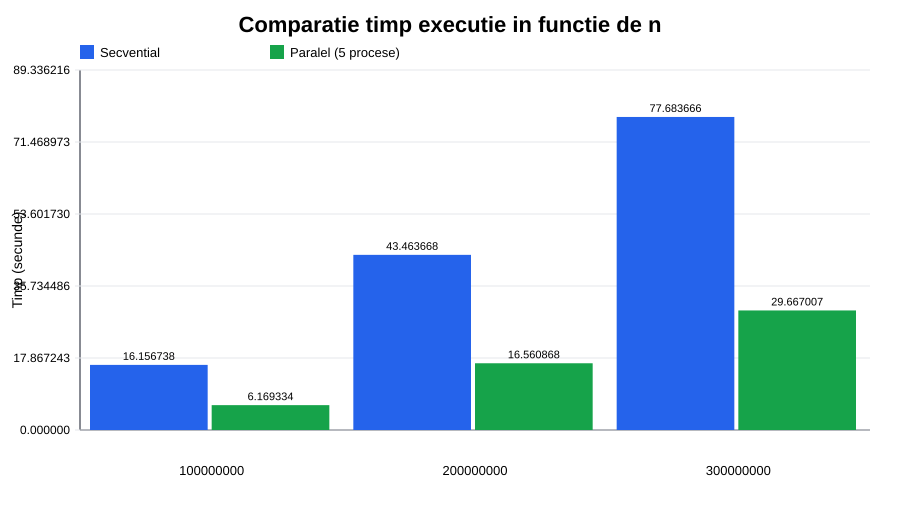
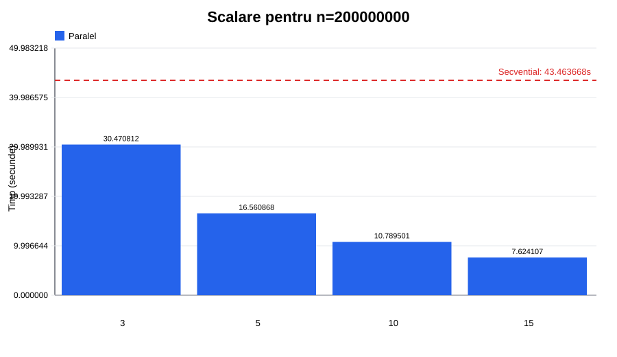

# Calculul numerelor prime într-un interval mare folosind OpenMPI

**Student: Zlatovcen Bogdan**

**Profesor: Ovidiu Gherman**

## 1. Tema lucrării

Scopul proiectului este calcularea numărului de valori prime din intervalul `[2, n]`, folosind două implementări:

- o implementare secvențială în C;
- o implementare paralelă în C cu OpenMPI.

Problema este potrivită pentru paralelizare deoarece verificarea primalității fiecărui număr este independentă de verificarea celorlalte numere. Astfel, intervalul poate fi împărțit între mai multe procese MPI, iar la final rezultatele parțiale sunt adunate.

## 2. Descrierea algoritmului secvențial

Programul secvențial primește un număr `n` și parcurge toate valorile din intervalul `[2, n]`. Pentru fiecare valoare se verifică dacă este primă:

- valorile mai mici decât `2` nu sunt prime;
- `2` este prim;
- numerele pare mai mari decât `2` nu sunt prime;
- pentru numerele impare se caută un divizor impar până la `sqrt(x)`.

La final se afișează numărul de prime găsite și timpul de execuție.

## 3. Descrierea algoritmului paralel

În implementarea OpenMPI, procesul cu rangul `0` este manager. El nu verifică numere prime, ci coordonează execuția, participă la sincronizare și afișează rezultatul final. Procesele cu rangurile `1..p-1` sunt workeri și primesc bucăți din intervalul `[2, n]`.

Dacă există `p` procese MPI în total, atunci numărul de workeri este `p - 1`. Intervalul `[2, n]` conține `n - 1` valori. Aceste valori sunt împărțite cât mai egal între workeri. Dacă împărțirea nu este exactă, primii workeri primesc câte o valoare în plus.

Pentru workerul cu indexul `i`, unde `i = rank - 1`, se folosesc formulele:

```text
total = n - 1
workeri = p - 1
dimensiune_baza = total / workeri
rest = total % workeri
dimensiune_worker = dimensiune_baza + 1, daca i < rest
dimensiune_worker = dimensiune_baza, daca i >= rest
```

Exemplu exact pentru `n = 200000000` și `p = 5` procese MPI:

| Proces MPI | Rol | Interval verificat |
|---:|---|---|
| 0 | manager | nu verifică numere |
| 1 | worker | `[2, 50000001]` |
| 2 | worker | `[50000002, 100000001]` |
| 3 | worker | `[100000002, 150000001]` |
| 4 | worker | `[150000002, 200000000]` |

Fiecare worker calculează local câte numere prime există în subintervalul primit. După terminarea calculelor, rezultatele sunt combinate cu `MPI_Reduce`, folosind operația `MPI_SUM`. Timpul raportat este timpul maxim dintre procese, pentru că programul paralel se termină doar după ce toți workerii au terminat lucrul.

## 4. Compilare și rulare

Pentru compilarea ambelor programe:

```bash
make
```

Pentru rularea implementării secvențiale:

```bash
cd sequential
make
./prime_sequential 200000000
```

Pentru rularea implementării paralele:

```bash
cd parallel
make
mpirun --oversubscribe -np 5 ./prime_parallel 200000000
```

Opțiunea `--oversubscribe` este utilă pe un calculator local când se rulează mai multe procese MPI decât numărul de core-uri disponibile. Pe un cluster sau într-un mediu MPI configurat cu sloturi suficiente, această opțiune poate fi eliminată.

Pentru rularea automată a tuturor testelor și generarea graficelor:

```bash
make benchmark
```

Scriptul salvează rezultatele în `report/results.csv` și graficele în `report/figures/`.

## 5. Date experimentale

Valorile pentru `n` au fost mărite pentru ca execuțiile să dureze suficient de mult încât diferențele să fie vizibile. Benchmark-ul complet a rulat aproximativ 4 minute. Pentru comparația în funcție de dimensiunea problemei s-au folosit valorile `n = 100000000`, `n = 200000000` și `n = 300000000`. Pentru comparația în funcție de numărul de procese s-a păstrat `n = 200000000` și s-au folosit `3`, `5`, `10` și `15` procese MPI. În numărul de procese este inclus și procesul manager `0`.

Rezultatele obținute:

| Mod | n | Procese | Numere prime | Timp (secunde) |
|---|---:|---:|---:|---:|
| Paralel | 100000000 | 5 | 5761455 | 6.169334 |
| Secvențial | 100000000 | 1 | 5761455 | 16.156738 |
| Paralel | 200000000 | 3 | 11078937 | 30.470812 |
| Paralel | 200000000 | 5 | 11078937 | 16.560868 |
| Paralel | 200000000 | 10 | 11078937 | 10.789501 |
| Paralel | 200000000 | 15 | 11078937 | 7.624107 |
| Secvențial | 200000000 | 1 | 11078937 | 43.463668 |
| Paralel | 300000000 | 5 | 16252325 | 29.667007 |
| Secvențial | 300000000 | 1 | 16252325 | 77.683666 |

## 6. Grafice

### 6.1. Comparație în funcție de dimensiunea problemei



Graficul compară timpul secvențial cu timpul paralel pentru `5` procese MPI, adică 1 manager și 4 workeri. Pentru valori mari ale lui `n`, varianta paralelă devine mai rapidă deoarece fiecare worker primește suficient lucru de calculat, iar costurile MPI devin mici în raport cu timpul total de calcul.

### 6.2. Comparație în funcție de numărul de procese



Graficul arată comportamentul pentru `n = 200000000`, folosind `3`, `5`, `10` și `15` procese MPI. Deoarece procesul `0` este manager, numărul real de workeri este `2`, `4`, `9`, respectiv `14`. Se observă că timpul scade când crește numărul de workeri, deoarece intervalul este împărțit în mai multe bucăți.

## 7. Concluzii

Implementarea paralelă este avantajoasă atunci când dimensiunea problemei este suficient de mare. Pentru intervale mici, implementarea secvențială poate fi mai rapidă deoarece nu are costuri MPI. Pentru intervale mai mari, împărțirea intervalului `[2, n]` între procese reduce timpul total de calcul.

Rezultatele confirmă că paralelizarea nu garantează automat un timp mai bun. Eficiența depinde de dimensiunea problemei, de numărul de procese și de costurile de comunicare/sincronizare.
